# 使用 1Panel PHP 运行环境部署 WordPress

## 概述

本教程将详细介绍如何在 1Panel 中通过 PHP 运行环境功能部署 WordPress 网站，并配置域名访问和 HTTPS 证书。1Panel 作为现代化的 Linux 服务器管理面板，提供了完整的网站部署和管理解决方案。

1Panel 的 PHP 运行环境管理功能可以提供：

- **多版本 PHP 支持**：支持 PHP 5.6、7.0-7.4、8.0-8.3 等多个版本，可根据应用需求灵活选择和切换
- **扩展管理**：提供常用 PHP 扩展库，支持一键安装、卸载和配置，包括 mysqli、gd、curl、zip、mbstring 等
- **可视化配置**：通过图形界面轻松配置 PHP 参数，包括文件上传限制、内存限制、执行时间、禁用函数等核心设置

## 前置条件

在开始本教程之前，请确保：

1. 拥有一台有公网 IP 的 Linux 服务器，例如阿里云、腾讯云、华为云云服务器等
2. 已安装并配置好 1Panel 面板
3. 已注册域名并能够管理 DNS 记录
4. 服务器防火墙已开放相应端口（80、443）

## 第一步：安装必要的运行环境

### 1.1 安装 OpenResty

OpenResty 是 1Panel 中用于网站管理的核心 Web 服务器，它基于 Nginx 并集成了增强的 LuaJIT 和丰富的第三方模块。

1. 登录 1Panel 控制台
2. 点击左侧菜单的 **应用商店**
3. 在应用列表中找到 **OpenResty**
4. 安装参数保持默认，点击安装，等待安装完成

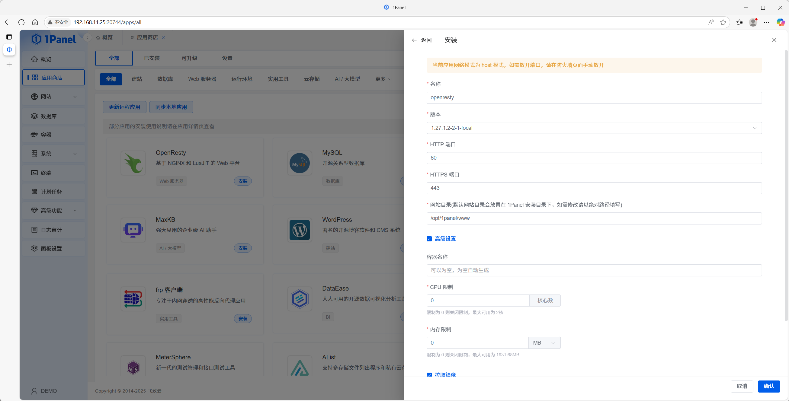

### 1.2 安装 MySQL 数据库

WordPress 需要数据库来存储内容，MySQL 是最常用的选择。

1. 在应用商店中找到 **MySQL**
2. 安装参数保持默认，点击安装
3. 等待安装完成

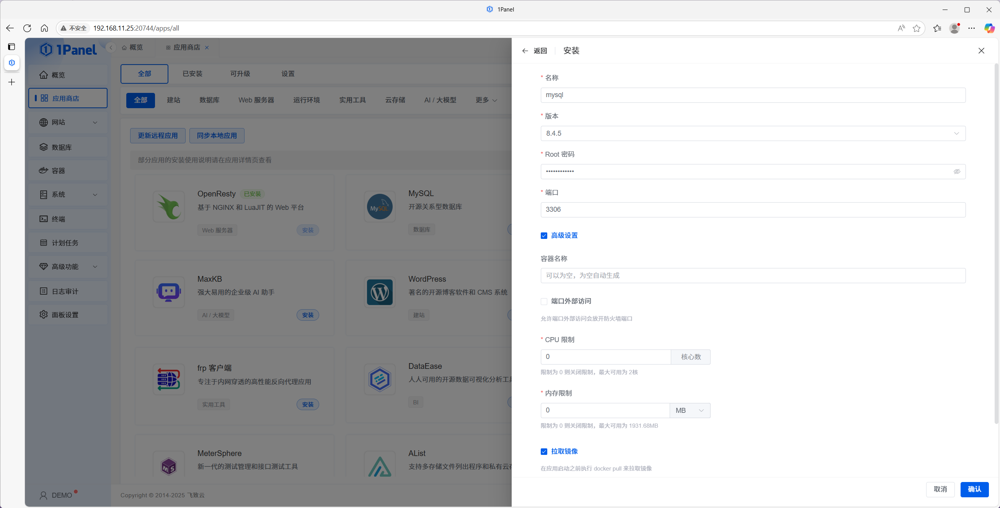

### 1.3 配置 PHP 运行环境

WordPress 基于 PHP 开发，需要配置 PHP 运行环境。

1. 点击左侧菜单的 **网站** -> **PHP 运行环境**
2. 选择 PHP，点击 **创建运行环境**
3. 填写名称等参数，选择适合的 PHP 版本（这里使用最新的 8.4.6）
4. 扩展模板选择 **WordPress**，包含了 WordPress 常用的扩展
5. 根据需要使用的主题、插件需求，添加其他扩展
6. 点击 **确定**，等待运行环境创建完成

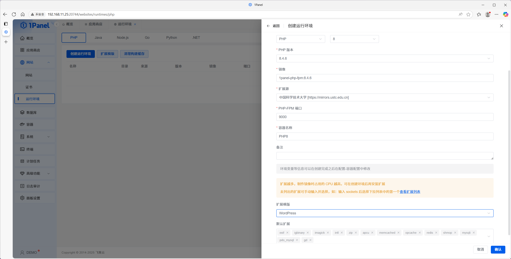

## 第二步：创建网站

### 2.1 创建网站记录

1. 点击左侧菜单的 **网站**
2. 点击 **创建网站**
3. 选择 **运行环境** 类型，选择刚才创建的 PHP 运行环境
4. 填写网站信息：
   - **名称**：WordPress 站点名称
   - **主域名**：你的域名（如：www.example.com）
   - **代号**：网站对应主目录的名称（如：www.example.com）
5. 设置默认网站为刚创建的网站

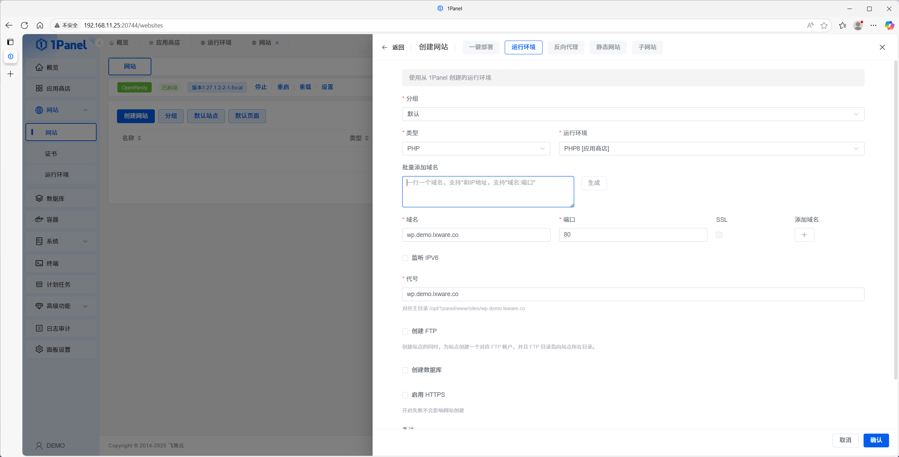
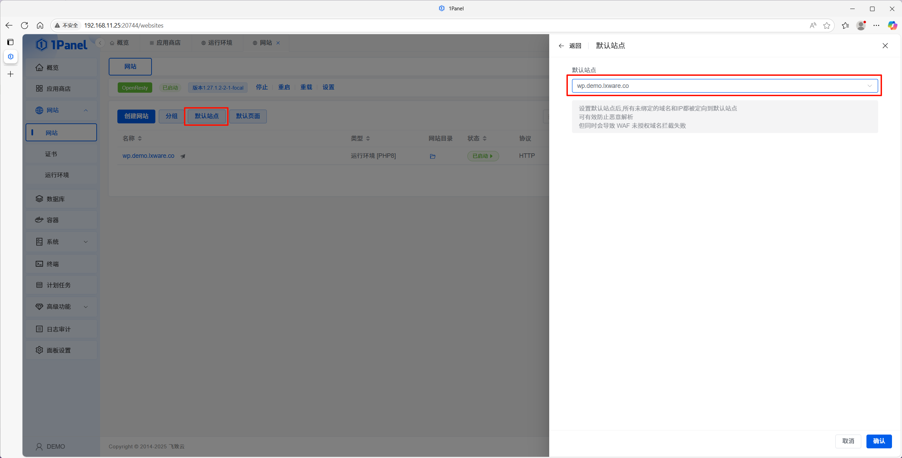

### 2.2 测试网站

1. 通过服务器 IP 地址访问网站，如果出现 PHP 环境信息，则表示网站创建成功

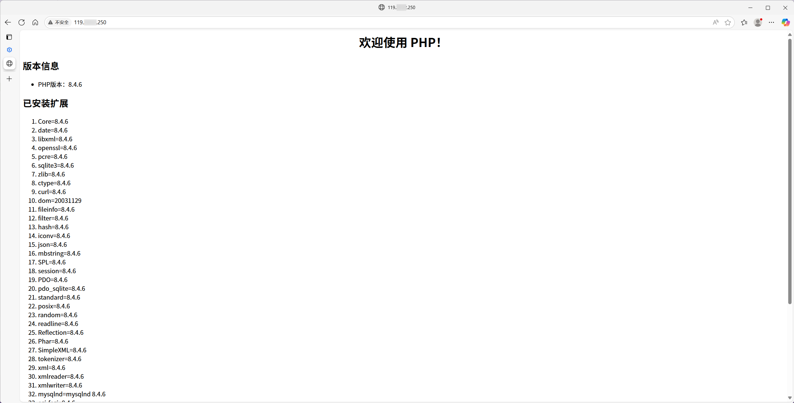

## 第三步：部署 WordPress

### 3.1 下载 WordPress

1. 点击网站目录图标，进入网站根目录
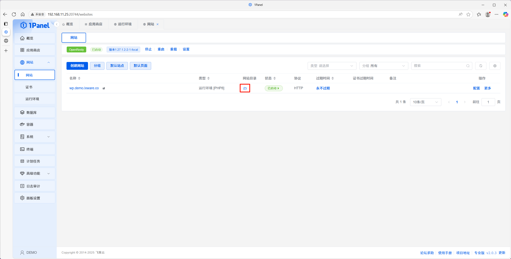
2. 通过远程下载功能，从 `https://wordpress.org/latest.zip` 下载 WordPress 最新版本
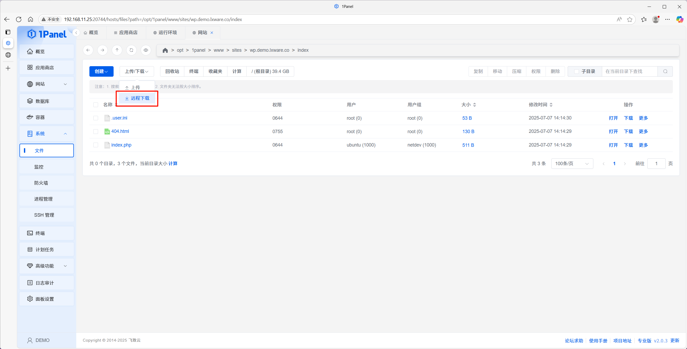
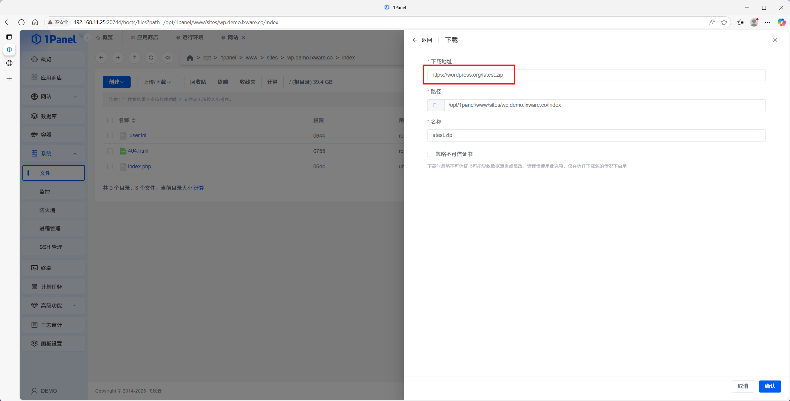
3. 下载完成后，解压到网站根目录，WordPress 相关文件会默认解压到当前目录下的 `wordpress` 目录中
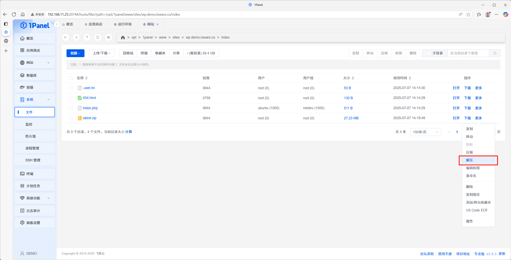
4. 返回网站设置，修改网站运行目录为 `wordpress`，点击 **保存并重载**
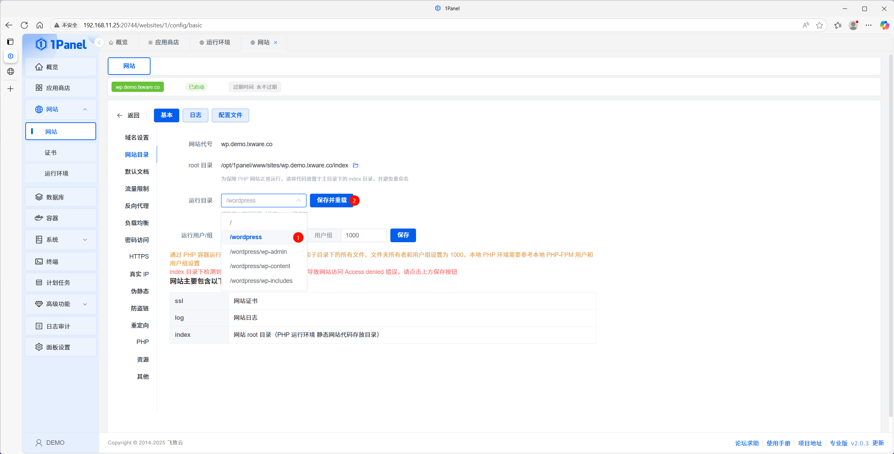

### 3.2 创建数据库

1. 点击左侧菜单的 **数据库**
2. 在 MySQL 类型数据库中，点击 **创建数据库**
3. 填写数据库信息：
   - **名称**：WordPress 数据库名称，例如 `wordpress`
   - **用户名**：WordPress 数据库用户名，例如 `wordpress`
   - **密码**：WordPress 数据库密码，系统随机生成，复制生成的密码并记录
4. 点击 **确定**，等待数据库创建完成
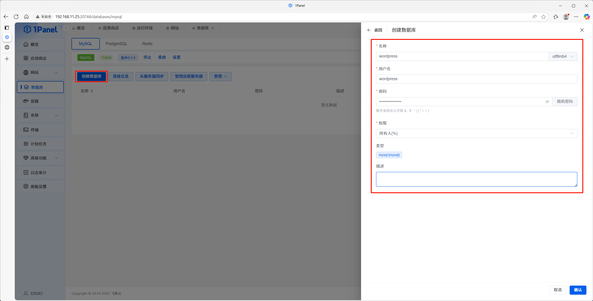
5. 点击 **连接信息**，记录数据库的容器连接信息以及上面创建的数据库名、用户名和密码，后续需要配置 WordPress 时使用
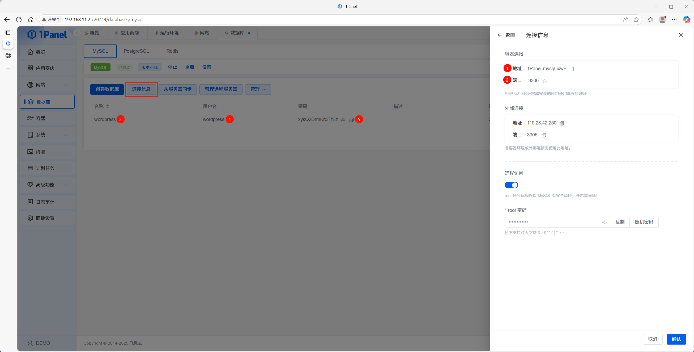

### 3.3 完成 WordPress 安装

1. 在浏览器中访问你的服务器 IP 地址，如果出现 WordPress 安装向导，则表示 WordPress 安装成功
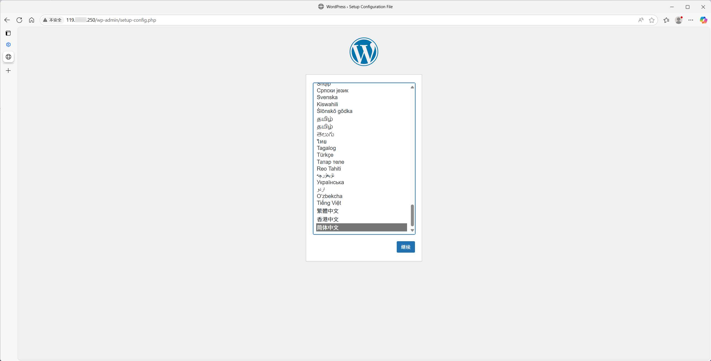

2. 选择语言，点击 **继续**，填入数据库信息，点击 **提交**
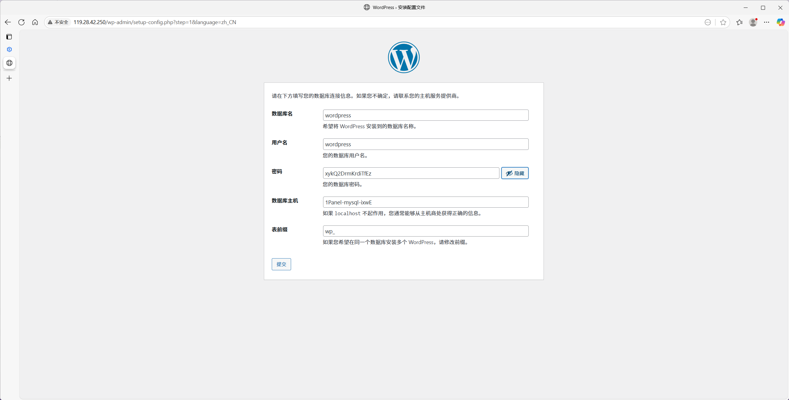

3. 按照 WordPress 安装向导完成安装：
   - 选择语言
   - 填写网站信息
   - 创建管理员账户
   - 完成安装

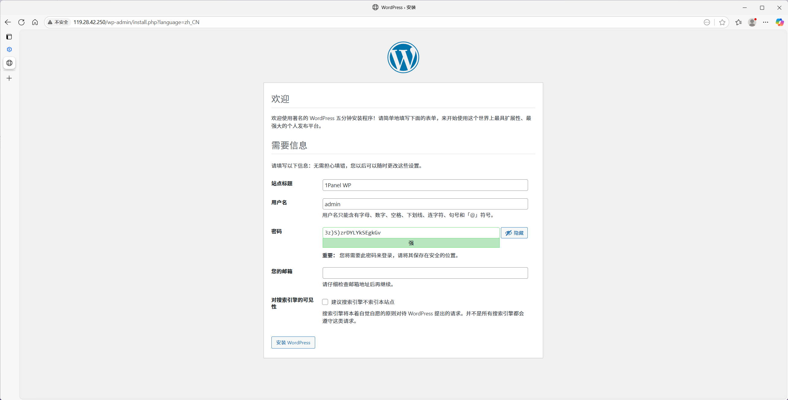

## 第四步：配置域名访问

### 4.1 添加 DNS 记录

1. 登录你的域名管理控制台（如 Cloudflare、阿里云等）
2. 添加 A 记录：
   - **记录类型**：A
   - **主机记录**：@（或 www）
   - **记录值**：你的服务器公网 IP 地址
   - **TTL**：600（或默认）

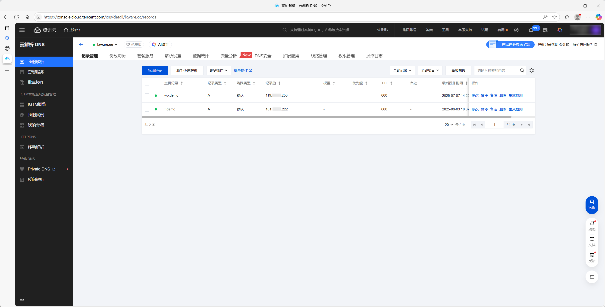

### 4.2 验证域名解析

1. 在浏览器中访问你的域名，如果出现 WordPress 首页，则表示域名解析成功

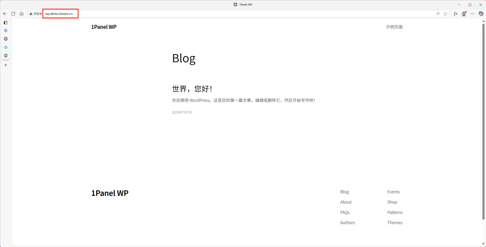

## 第五步：配置 HTTPS 证书

### 5.1 创建 ACME 账户

1. 在 1Panel 中点击 **证书管理**
2. 点击 **管理 ACME 账户**
3. 填写邮箱地址
4. 选择账户类型和加密算法
5. 创建 ACME 账户

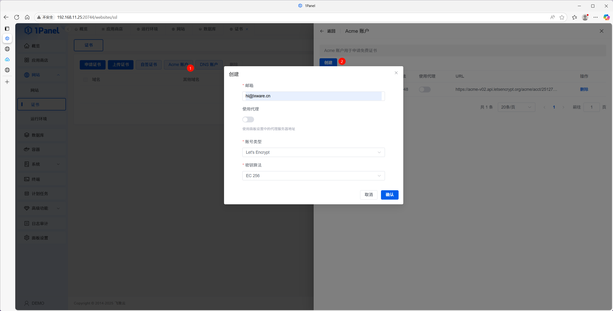

### 5.2 配置 DNS 提供商

1. 点击 **管理 DNS 提供商**
2. 选择你的 DNS 服务商（以腾讯云为例）
3. 填写 API 凭据

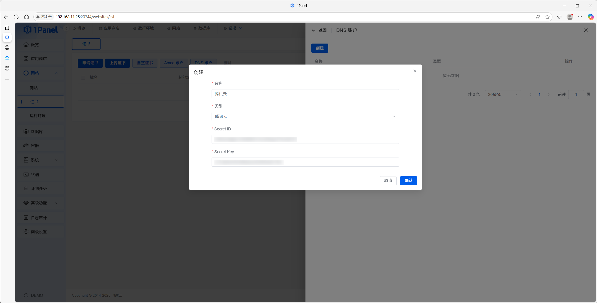

### 5.3 申请 SSL 证书

1. 在证书管理页面点击 **申请**
2. 填写证书信息：
   - **主域名**：你的域名（如：example.com）
   - **ACME 账户**：选择刚创建的账户
   - **验证方式**：选择 DNS 验证
   - **DNS 提供商**：选择刚配置的 DNS 账户
3. 点击确认，等待证书申请完成

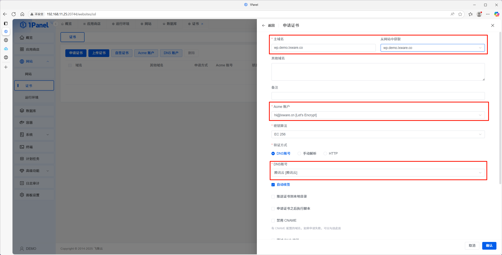

### 5.4 启用 HTTPS

1. 进入网站管理页面
2. 点击你的网站名称进入配置页面
3. 在 **SSL 设置** 中：
   - 启用 HTTPS
   - 选择刚申请的证书
   - 配置强制 HTTPS 重定向
4. 保存设置

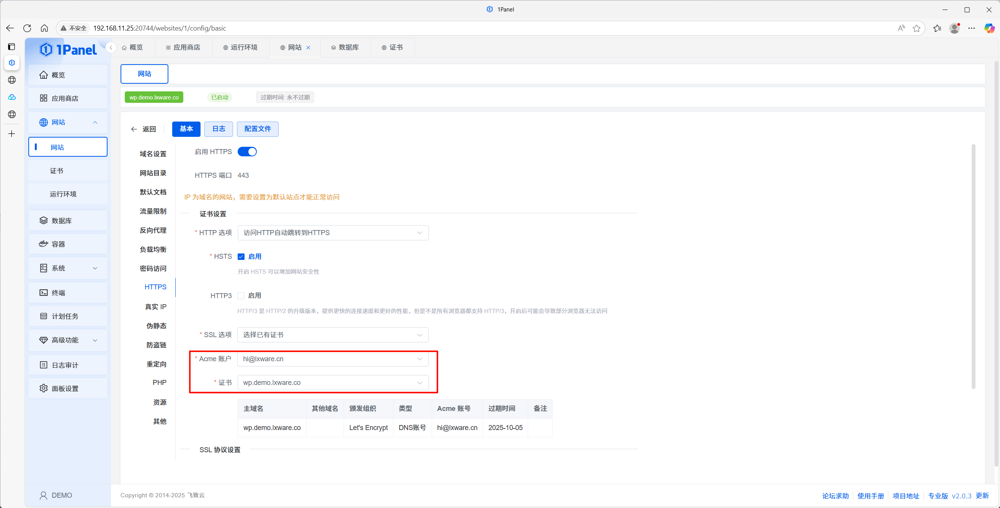

使用 HTTPS 地址 `https://wp.demo.lxware.com` 再次访问网站，如果出现 WordPress 首页，则表示 HTTPS 配置成功。

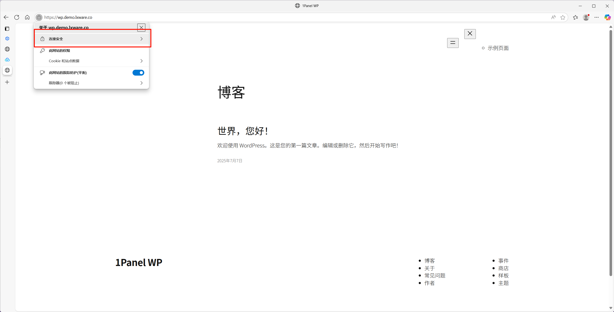

## 相关链接

- [1Panel 在线安装教程](https://1panel.cn/docs/v2/installation/online_installation/)
- [1Panel 官方文档](https://1panel.cn/docs/)
- [1Panel 社区论坛](https://bbs.fit2cloud.com/c/1p/7)

---

*本教程基于 1Panel 最新版本编写，如有疑问请参考官方文档或社区论坛。*
